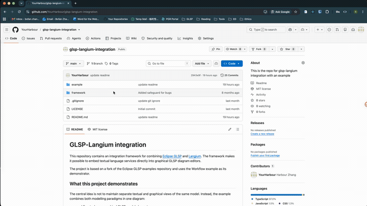

# GLSP-Langium integration

This repository contains an integration framework for combining [Eclipse GLSP](https://github.com/eclipse-glsp/glsp) and [Langium](https://github.com/eclipse-langium/langium). The framework makes it possible to embed textual language services directly into graphical GLSP diagram editors.

The project is based on a fork of the Eclipse GLSP examples repository and uses the Workflow example as its demonstrator.

## Demo



The screencast walks through the Workflow example end to end: hovering the tasks that provide `water:level` and `temperature:degree`, editing a conditional edge's guard in an embedded Monaco editor, live Langium validation when an out-of-scope variable or an unknown property is referenced, and a short tour of the code that wires the graph-derived scoping together. A full-resolution version with subtitles is in [`demo/demo.mp4`](demo/demo.mp4).

## What this project demonstrates

The central idea is not to maintain separate textual and graphical views of the same model. Instead, the example combines both modelling paradigms in one diagram:

- workflow tasks are graphical GLSP model elements;
- selected tasks provide variables, such as `water:level` or `temperature:degree`;
- conditional edges contain embedded Monaco editors;
- the text inside those editors is parsed, linked, completed, and validated by a Langium language server running in a web worker;
- Langium receives scoping information from the GLSP graph, so a condition can only reference variables that are visible from its position in the workflow.

For example, a conditional edge downstream of the `ChkWt` task can use:

```text
if water.level >= 50
```

If the same edge references an out-of-scope variable or an invalid property, Langium reports diagnostics and GLSP displays them as diagram markers.

## Repository structure

- `framework` - reusable integration code published as the npm package `glsp-langium-integration`.
- `example/workflow` - Workflow-based GLSP example that uses the framework.
- `example/workflow/workflow-glsp` - client-side diagram code, Monaco integration, Langium grammar, worker setup, and graph-derived scoping.
- `example/workflow/workflow-server` - GLSP server, model extensions, operation handlers, and persistence of condition edits.
- `example/workflow/workspace/coffee.wf` - example workflow model used for the demo.
- `example/statemachine` - Statemachine example based on the official Langium statemachine language (see below).

## Example gallery

The two examples demonstrate different integration styles.

| | [Workflow](example/workflow) | [Statemachine](example/statemachine) |
| --- | --- | --- |
| Textual sub-languages | 1 (condition expressions) | 2 (declarations + transition labels) |
| Referenced elements | Graphical task nodes | Another grammar-controlled textual element |
| Scoping style | Position-dependent (upstream tasks only) | Global (all declared events/commands) |
| Editor style | Single-line labels on edges | Multi-line declarations block + single-line edge labels |
| Origin of the language | GLSP workflow example, extended with conditions | Official Langium statemachine example, split into graphical structure and textual content

## Key implementation files

- `framework/src/glsp/glsp-langium-module.ts` registers the reusable GLSP-side integration services.
- `framework/src/glsp/editor/monaco-label.view.tsx` renders Monaco-backed labels inside the SVG diagram.
- `framework/src/glsp/validation/langium-scoping-information.handler.ts` forwards graph-derived scoping information to the Langium worker.
- `framework/src/glsp/validation/langium-validation.handler.ts` converts Langium diagnostics into GLSP markers.
- `framework/src/langium/worker/start.ts` starts the Langium language server and the GLSP communication listeners.
- `example/workflow/workflow-glsp/src/langium/ls/grammars/conditional_edge.langium` defines the embedded condition language.
- `example/workflow/workflow-glsp/src/langium-integration/variable-scope.ts` computes which variables are visible to each conditional edge.
- `example/workflow/workflow-glsp/src/langium/ls/workflow-dsl-references.ts` exposes graph elements as Langium external references.
- `example/workflow/workflow-glsp/src/langium-integration/monaco-submit.service.ts` submits edited condition text back to GLSP.
- `example/workflow/workflow-server/src/conditionedit/apply-condition-edit-handler.ts` persists condition edits in the GLSP source model.

## Authors

- Andreas ([@Sakrafux](https://github.com/Sakrafux))
- BoFan ([@YourHarbour](https://github.com/YourHarbour))

## Prerequisites

- [Node.js](https://nodejs.org/en/) `>=22`
- [Yarn Classic](https://classic.yarnpkg.com/en/docs/install) `>=1.7.0 <2`

The example is an Eclipse Theia application, so the [Theia development prerequisites](https://github.com/eclipse-theia/theia/blob/master/doc/Developing.md#prerequisites) may also apply to your system.

## Build and run the example

From the repository root:

```bash
cd example/workflow
yarn
yarn build
yarn start
```

Open `http://localhost:3000` and load `coffee.wf` from the workspace in the Workflow Diagram Editor.

For debugging with an external GLSP server:

```bash
cd example/workflow
yarn start:server
yarn start:external
```

To work in watch mode:

```bash
cd example/workflow
yarn watch
```

